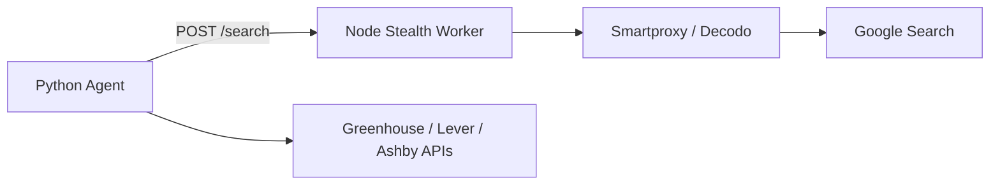

# JobFindr

Free open-source AI agent that discovers job openings matching your skills, location, and company preferences. Uses LLM-driven company discovery, stealth Google search (via Node.js worker + proxies), and public ATS APIs (Greenhouse, Lever, Ashby).

## Architecture

```
SearchConfig (manual inputs)
    → VC portfolio discovery: scrape 10–15 local VC pages + YC API
    → data/target_companies.json: master company list
    → Node stealth worker: Google search via puppeteer-extra-stealth + proxy
    → ATS slug probe fallback (when search is blocked)
    → ATS APIs: fetch job postings
    → Gemini: filter and score relevance
    → Resume scoring (optional): title-only fit 0–100, then full description for promising jobs
    → results/<timestamp>.json
```



## Setup

### 1. Python dependencies

```bash
python -m venv .venv
source .venv/bin/activate
pip install -r requirements.txt
```

### 2. Node worker dependencies

```bash
cd worker
npm install --ignore-scripts
node node_modules/puppeteer/install.mjs
cd ..
```

### 3. Configure environment

```bash
cp .env.example .env
```

| Variable | Description |
|----------|-------------|
| `GEMINI_API_KEY` | Google AI API key |
| `GEMINI_DEFAULT_MODEL` | Model name (default: `gemini-2.5-flash`) |
| `WORKER_URL` | Stealth worker URL (default: `http://127.0.0.1:3847`) |
| `DECODO_*` or `PROXY_URL` | Residential proxy for Google search (recommended) |

**Proxy setup (Decodo):**

```env
DECODO_USERNAME=your_user
DECODO_PASSWORD=your_pass
DECODO_HOST=gate.decodo.com
DECODO_START_PORT=10001
DECODO_END_PORT=10010
```

The worker rotates ports in that range per request for fresh IPs. Without a proxy, Google search will often return CAPTCHAs. The agent falls back to ATS slug probing when search is blocked.

## Usage

**Terminal 1** — start the stealth worker:

```bash
cd worker && npm start
```

**Terminal 2** — run the agent:

Edit search parameters in [`config.py`](config.py) (`DEFAULT_SEARCH_CONFIG`), then:

```bash
python main.py
```

Example config:

```python
DEFAULT_SEARCH_CONFIG = SearchConfig(
    role="Software Engineer",
    location="New York City, NY",
    company_profile="Series A–C tech startups",
    experience="Entry level",
    posted_within_days=30,
    max_companies=10,
    include_remote=True,
    use_vc_discovery=True,   # scrape VC portfolios (Primary, USV, BoxGroup, YC API, etc.)
    max_vc_firms=12,
    require_hiring=False,    # set True to filter YC companies with isHiring badge
)
```

Portfolio companies are saved to `data/target_companies.json` before ATS resolution runs.

### Resume qualification scoring

Place your resume as plain text in `resume.txt` (see [`resume.txt.example`](resume.txt.example)). The file is gitignored since it contains personal data.

When `resume.txt` exists and `resume_enabled=True` in config, each filtered job gets a **qualify_score (0–100)**:

| Score | Meaning |
|-------|---------|
| 0 | No realistic chance |
| 25 | Weak stretch |
| 50 | Possible fit |
| 75 | Good fit |
| 100 | Overqualified |

Scoring runs in two stages to save tokens:

1. **Title-only** — Gemini compares your resume against job title + metadata for all filtered jobs
2. **Full description** — only for jobs scoring above `resume_deep_threshold` (default 25); fetches ATS job descriptions and re-scores

Config options in [`config.py`](config.py):

```python
resume_path="resume.txt",
resume_deep_threshold=25,  # fetch descriptions above this title score
resume_enabled=True,       # auto-skips if file missing
```

Results sort by `qualify_score` when resume scoring is active. `match_score` still reflects search-config relevance (role, location, experience).

### Direct-target test mode

Skip LLM discovery and test ATS fetching with a known board:

```python
from models.job import CompanyTarget

DEFAULT_SEARCH_CONFIG = SearchConfig(
    role="Software Engineer",
    location="Remote",
    company_profile="test",
    direct_targets=[
        CompanyTarget(
            name="Stripe",
            ats_type="greenhouse",
            board_token="stripe",
            careers_url="https://boards.greenhouse.io/stripe",
        ),
    ],
)
```

## Output

Results are written to `results/<timestamp>.json` and a summary is printed to the console.

Each run tracks **usage** in the results JSON and console summary:

- **AI tokens** — prompt, completion, and total tokens across all Gemini calls
- **Proxy traffic** — estimated bytes up/down and request count through Decodo (via the Node worker)

Check live worker totals anytime: `curl http://127.0.0.1:3847/metrics`

For billing-grade numbers, also check your [Decodo dashboard](https://decodo.com/) — local counters are estimates from browser request/response sizes.

## Project structure

```
jb_findr/
├── main.py                  # Entry point
├── config.py                # SearchConfig + env loading
├── agent/
│   ├── orchestrator.py      # End-to-end pipeline
│   ├── discovery.py         # Company discovery + stealth search
│   ├── parser.py            # Job filtering and scoring
│   ├── resume_loader.py     # Load resume.txt
│   ├── resume_scorer.py     # Two-stage resume fit scoring
│   ├── gemini_client.py     # Gemini structured output helper
│   └── worker_client.py     # HTTP client for Node worker
├── fetchers/
│   ├── job_descriptions.py  # ATS job description fetcher
│   ├── ats_detector.py      # URL → ATS type detection
│   ├── ats_probe.py         # Slug-based ATS board probing
│   ├── greenhouse.py        # Greenhouse API
│   ├── lever.py             # Lever API
│   ├── ashby.py             # Ashby API
│   └── registry.py          # Fetcher registry + rate limiting
├── worker/                  # Node.js stealth scraping worker
│   ├── src/server.js
│   ├── src/scraper.js
│   └── package.json
├── models/
│   └── job.py               # Pydantic schemas
└── output/
    └── writer.py            # JSON + console output
```

## Roadmap

- Stealth `/scrape` integration for non-ATS career pages (Workday network JSON interception)
- FastAPI layer for frontend
- CAPTCHA solver integration (2Captcha) as last resort

## License

MIT — see [LICENSE](LICENSE).
